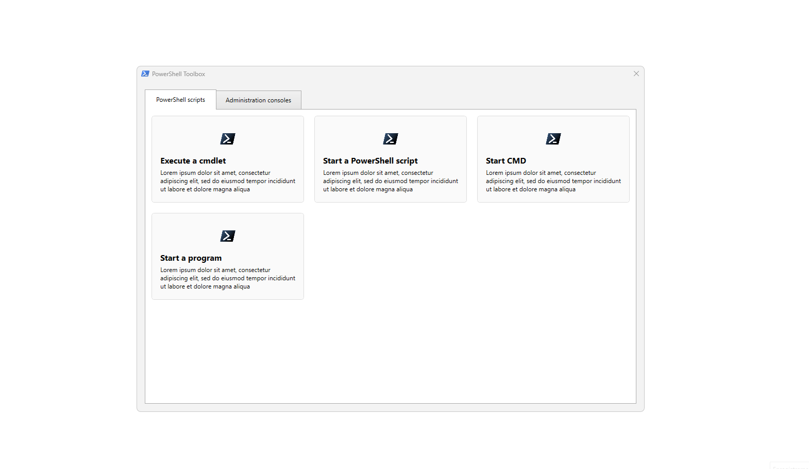

# PowerShellToolbox

A simple way to gather all your PowerShell scripts in a single interface without having to bother with XAML or WinForm! Inspired by [dan-osull's PowerShell-Script-Menu-Gui](https://github.com/dan-osull/PowerShell-Script-Menu-Gui)



## How does this work?

The script will automatically generate a WPF user interface based on the content of a JSON file. You don't have to know anything about WPF or XAML to use this script.

The script is ready to go: if you want to try it, you'll just have to execute it using PowerShell 5.1+. Then you can start modifying the configuration file to add your own shortcuts.

### JSON file

By default, the script will use the `data.json` file. The best way to start using this script is to modify this file and customize it.

In the default JSON file, you'll find two tabs (*PowerShell scripts* and *Administration consoles*). In the tab configuration you can modified:

- tabName: the title of the tab
- position: in which order the tab will be displayed (from the smallest to the largest number)
- columns: the number of columns available to display the buttons
- rows: the number of rows available to display the buttons
- buttons: the list of buttons to be created

About the buttons, you can modify:

- title: button main title, has to be unique in all the JSON file
- icon: the path to the image to display, it can be an URL or a local file path
- text: a short description of the action of the button
- action: the code to execute in PowerShell (will be interpreted using `Invoke-Expression`)

Keep in mind that `\` is the escape character for JSON, so in case you want to use it, you'll have to double it. For example: *C:\script\main.ps1* should be transform in *C:\\script\\main.ps1*.

#### Example

```json
[
    {
        "tabName":  "PowerShell scripts",
        "position":  1,
        "columns":  3,
        "rows":  3,
        "buttons":  [
            {
                "title":  "Execute a cmdlet",
                "icon":  "https://upload.wikimedia.org/wikipedia/commons/a/af/PowerShell_Core_6.0_icon.png",
                "text":  "Lorem ipsum dolor sit amet, consectetur adipiscing elit, sed do eiusmod tempor incididunt ut labore et dolore magna aliqua",
                "action":  "Start-Sleep 1"
            }
        ]
    }
]
```

### XAML files

The final user interface is generated using three separate files:

Order | File | Detail
----- | ---- | ------
1 | main.xml | Contains the main window. Manages the display size (height, width and resizing) and the title.
2 | tab.xml | Manages tab controls and grid configuration (how many rows and columns to contain)
3 | button.xml | Creation of the button with the icon, the title and the text to display

Each file contains placeholders indicated by a double brace (like this: `{{example}}`) which will be replaced by values from the JSON file or calculated by PowerShell.

### Compatibility

This script has been tested with PowerShell 5.1 & 7.3.4, on Windows 11 and Windows Server 2022.
